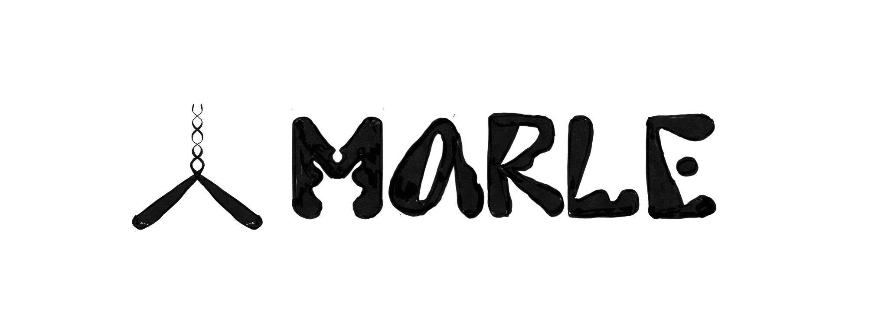

# Origin - Marle



Origin Marle is an interactive art experience created by the Origin Collective, commissioned by the 4A Centre for Contemporary Asian Art.

Visit the site <a href='https://j-fan.github.io/marle/'>here</a>

To build and run this repo, you need pnpm version 7. Install it using:

```
corepack prepare pnpm@v7.11.0 --activate
```

Finally to install within the folders use:

```
pnpm i --frozen-lockfile
```
